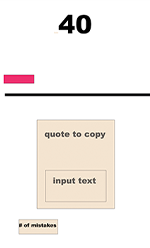
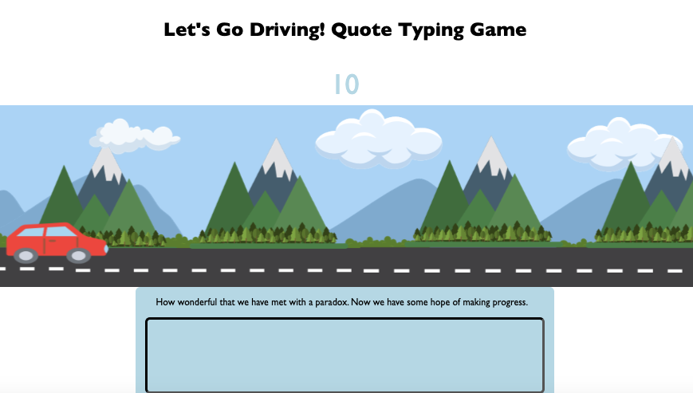

# Minimum Viable Project Outline

- **Outline for the MVP (Minimum Viable Product/Project)**

  - My FP started out as Speed Typing Car Race Game and turned into Let's Go Driving! A Quote Typing Game based on what happened during the creative process
  - **MY UI Outline started out like this:**

    1. Build a box where you bring in a random quote from an API
    2. Create a box for a player to type in the quote
       to test their speed
    3. Add a timer
    4. Add modals with different styles for different WPM scores

    **MY UI Outline ended up like this:**

    Do the above and then:
    
    1.  Add a car
    2.  Add a highway
    3.  Add directions

  **My Functional Outline started out like this:**

  1.  Bring in quotes from an API
  2.  Alternately, make a JSON file with an array of quotes
  3.  Find how to make a timer starting at 0 in JS
  4.  Find how to check what the player is typing
      and see if it matches the quote
  4.  Find how to show the player their errors

  **I figured out how to do all these things watching the webdev video, so I used it as a code along to learn everything I forgot about asynch again**

**My functional outline just built on the above to spin it like this:**

1.  Find how to make WPM speed the car up
2.  The best way to calculate WPM based on what I want to do with it and the car
3.  Find how to make the car go right
4.  Find how to factor the speed
5.  Find out what happens when a sprite hits the right side of the screen and what to do about it

**The paradigms included in my game:**

Imperative Programming for the text box where the player types their answers and in the function getNewQuote, which fetches a quote from a quote API.

Event Driven Programming when the event listener is waiting to respond to what they type. The players’ input also triggers a callback function to change what the player sees on the screen.

Asynchronous Programming when the game uses async and await to get new random quotes from the API.

**Original Wireframe Sketch:**

**Changed it to look like this:**

- If I had more time my first stretch goal would be to make the car infinitely scroll but seem like it's speeding up or slowing down based on the player's speed at submitting an accurate quote

- My second stretch goal would be to add some short words that pop up every now and then so you can answer quickly and speed up faster to make things more exciting

- Choose which car you drive
- Choose who or what you are racing

Ashley Rice
